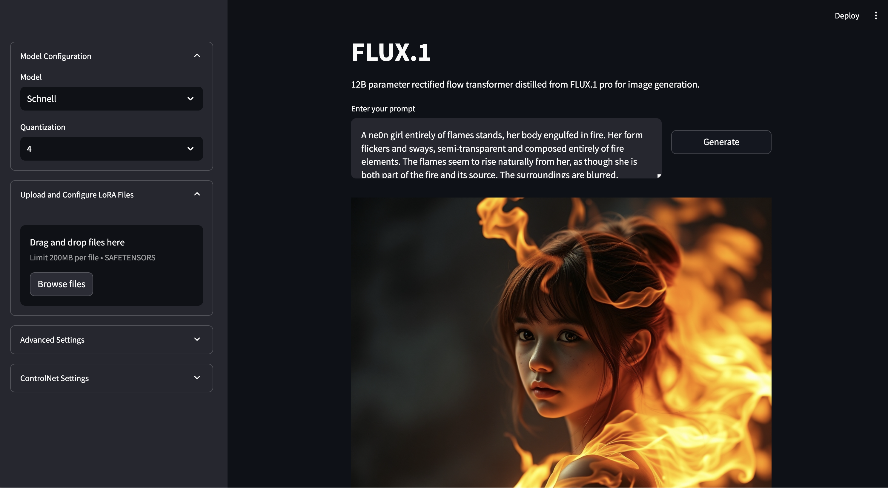
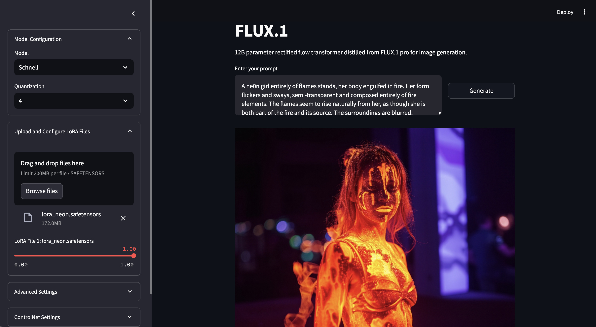
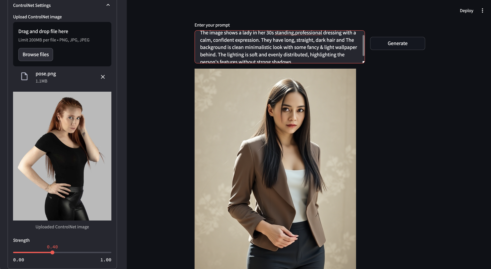

# mflux-streamlit

[](https://pypi.org/project/mflux-streamlit)
[](https://pypi.org/project/mflux-streamlit)

A web app gui for [mflux](https://pypi.org/project/mflux/) python library implemented with [Streamlit](https://docs.streamlit.io/)

-----

## Table of Contents

- [Features](#features)
- [Installation](#installation)
- [License](#license)

## Features

- Multiple MFLUX model families from a single UI, each with its own variants and controls:
  - **FLUX.1** (Schnell / Dev / Krea-Dev) — txt2img, img2img, Kontext editing, ControlNet (Canny)
  - **FLUX.2** (Klein 4B/9B, distilled & base) — fast txt2img and image editing
  - **Z-Image** (Turbo / base) — fast, small, high realism
  - **FIBO** (FIBO / FIBO-lite / FIBO-Edit) — natural-language or JSON prompts, editing
  - **Qwen-Image** (txt2img / edit) — strong prompt understanding and world knowledge
  - **SeedVR2** (3B / 7B) — image upscaling by target resolution or scale factor
  - **Depth Pro** — fast, accurate depth-map estimation
- Multiple LoRAs and scales for each LoRA adapter (where supported)
- Optional reference / source image for img2img, editing, ControlNet, upscaling and depth
- Per-variant quantization (4-bit / 8-bit), guidance, steps and negative-prompt controls

## Previews
|  |  |
| --- | --- |
| FLUX.1 Schnell | FLUX.1 Schnell with LoRA |

| |  |
| --- | --- |
| ControlNet Image<br/>[Source](https://atlegras.medium.com/pose-like-a-pro-ais-recommendations-for-woman-standing-portraits-1c4194ae63c6) | FLUX.1 Schnell with Controlnet |


### Todo List

- Beautify the web UI and improve UX

## Installation

### Normal User Install

```sh
brew install uv
uv tool install mflux-streamlit
cd /your/directory

mflux-streamlit  
```

### Developer Install

```sh
# dev workaround: run the main.py
uv venv && source .venv/bin/activate
uv pip install -e .
streamlit run src/app.py
```

## License

`mflux-streamlit` is distributed under the terms of the [MIT](https://spdx.org/licenses/MIT.html) license.
